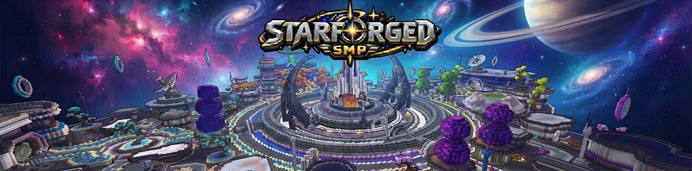

<h1 align="center">Hey! I'm L1cked</h1>

<p align="center">
  
</p>

<p align="center">
  Building Minecraft systems, web applications, and tools that solve real problems.
</p>

<p align="center">
  <a href="https://github.com/Louguerrier22">
    
  </a>
  <a href="https://github.com/L1cked">
    
  </a>
  <a href="https://discord.com/users/660765177527926795">
    
  </a>
</p>

---

## About Me

- Working with **Java, Kotlin, JavaScript, Python, C#, PHP, and SQL**.
- Building with **Gradle, Laravel, PostgreSQL, MySQL, WinUI, and .NET**.
- Into **coding, networking, cybersecurity, Minecraft systems, and useful tools**.
- Developing everything from player-facing interfaces and gameplay to databases, integrations, and cross-server systems.
- Running [**L1cked**](https://github.com/L1cked), my personal GitHub organization for public projects.
- Always learning, shipping, and improving what I've already built.

## Tech Stack

<p align="center">
  
</p>
<p align="center">
  
</p>

<p align="center">
  <strong>Minecraft:</strong> Paper &middot; Velocity &middot; Geyser/Floodgate<br />
  <strong>Desktop &amp; configuration:</strong> WinUI &middot; .NET &middot; YAML
</p>

---

## Main Projects

<p align="center">
  
</p>

<h3 align="center">StarForgedSMP</h3>

<p align="center">
  
</p>

<p align="center">
  <strong>Survival &middot; Creative &middot; Java &amp; Bedrock crossplay</strong>
</p>

<p align="center">
  I'm developing the systems behind StarForged: progression, claims, player markets,<br />
  cosmetics, and shared social features across the network.<br />
  Built around Kotlin, Paper, Velocity, PostgreSQL, and Geyser/Floodgate.
</p>

<p align="center">
  <a href="https://discord.gg/sYRJK6XYzS">
    
  </a>
</p>

<table align="center">
<tr>
<td valign="middle"><strong>Play StarForgedSMP</strong></td>
<td valign="middle">

```text
starforgedsmp.net
```

</td>
</tr>
</table>

---

<p align="center">
  <a href="https://l1cked.github.io/MayorSystem/">
    
  </a>
</p>

<h3 align="center">MayorSystem</h3>

<p align="center">
  A customizable Paper plugin for mayor elections, voting, server-wide perks,<br />
  displays, admin tools, integrations, and addon development.
</p>

<p align="center">
  <a href="https://l1cked.github.io/MayorSystem/">
    
  </a>
  <a href="https://github.com/L1cked/MayorSystem">
    
  </a>
  <a href="https://deepwiki.com/L1cked/MayorSystem">
    
  </a>
  <a href="https://modrinth.com/plugin/mayorsystem">
    
  </a>
</p>

## More Public Projects

| Project | What it does |
| --- | --- |
| [**ContractScrolls**](https://github.com/L1cked/ContractScrolls) | Evidence tools to help Minecraft server staff. |
| [**SystemSellAddon**](https://github.com/L1cked/SystemSellAddon) | Sell and worth features with MayorSystem bonus integration. |
| [**SystemSkyblockStyleAddon**](https://github.com/L1cked/SystemSkyblockStyleAddon) | Skyblock-style perks for MayorSystem. |
| [**SuperClearChat**](https://github.com/L1cked/SuperClearChat) | A focused Minecraft clear-chat plugin. |
| [**MinecraftPCviber**](https://github.com/L1cked/MinecraftPCviber) | Gameplay-driven lighting through OpenRGB. |

---

## How I Build

I care about **clear interfaces, reliable behavior, and maintainable code**. I like tracing problems to their source, making focused improvements, and keeping configuration, documentation, and the actual experience in sync.

## GitHub Stats

<p align="center">
  <a href="https://github.com/Louguerrier22">
    
  </a>
</p>

## Let's Connect

<p align="center">
  Have a question about a project or want to talk development?<br />
  Open an issue in its repository or <a href="https://discord.com/users/660765177527926795"><strong>reach me on Discord</strong></a>.
</p>

<p align="center">
  <a href="https://discord.com/users/660765177527926795">
    
  </a>
</p>

<p align="center">
  
</p>
